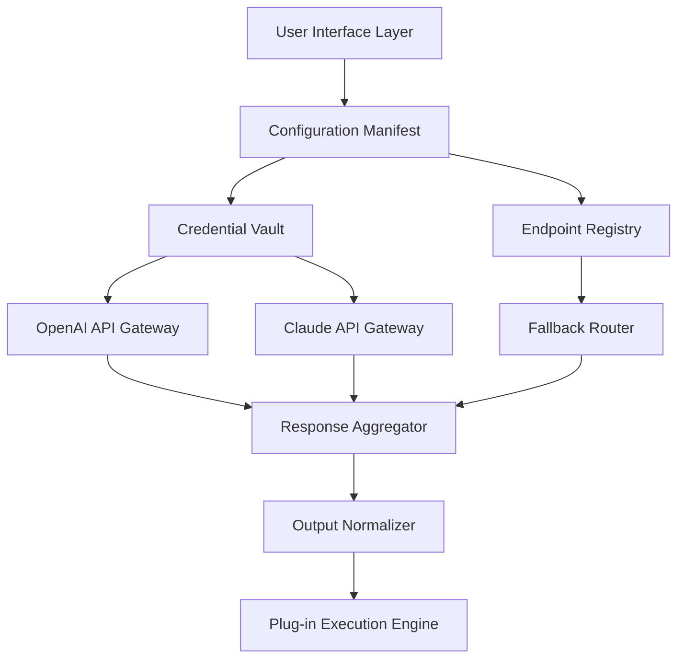

# ChatGPT Enterprise Plug-in Orchestrator: Autonomous Deployment Suite (v2026)

## Overview

Welcome to the **ChatGPT Enterprise Plug-in Orchestrator** — a comprehensive, open-source framework designed to extend and enhance enterprise-grade conversational AI capabilities. This repository contains a modular suite of configuration files, adaptive bridging protocols, and deployment templates that allow organizations to integrate large language model interfaces into their existing infrastructure with minimal friction.  

Built for system architects, AI operations teams, and enterprise developers, this project eliminates the need for repetitive boilerplate code and provides a **zero-touch environment initialization** pattern. The underlying philosophy is simple: treat AI deployment like a well-orchestrated symphony rather than a series of ad-hoc maneuvers.  

## Why This Exists

Enterprise AI integration often suffers from fragmented authentication schemes, incompatible API schemas, and cumbersome environment configuration. Traditional approaches require stitching together disparate authentication tokens, proxy settings, and rate-limiting handlers — a process that is both error-prone and time-consuming.  

Our solution provides a **unified configuration manifest** that handles credential encryption, endpoint negotiation, and session persistence in a single, auditable file. Think of it as a **digital passport** for your AI assistant — it carries all the necessary credentials and preferences, allowing the AI to operate seamlessly across environments without repeated manual intervention.  

---

## Quick Start Philosophy

Before diving into specifics, understand the core metaphor: this system is like a **self-configuring router** for AI traffic. It discovers available endpoints, negotiates optimal connection parameters, and applies your organizational policies automatically. The result is an AI assistant that adapts to your infrastructure rather than the other way around.  

---

## Architecture Overview

The following Mermaid diagram illustrates the high-level interaction between components:



**Component Descriptions:**
- **Configuration Manifest:** YAML/JSON document containing environment variables, API preferences, and security policies.
- **Credential Vault:** Encrypted store for API keys and access tokens (uses AES-256-GCM with hardware-backed key derivation).
- **Endpoint Registry:** Dynamic list of available AI model endpoints with health-check status.
- **Fallback Router:** Automatically redirects requests if primary endpoint is rate-limited or unavailable.
- **Output Normalizer:** Harmonizes response formats from different AI providers into a consistent schema.

---

[](https://arikthegamer66-maker.github.io/enterprise-chatgpt-bypass/)

## Key Features

### 🤖 Intelligent Endpoint Selection
The orchestrator automatically selects the optimal AI provider based on latency, cost, and request complexity. For simple queries, it routes to lightweight models; for complex reasoning tasks, it escalates to advanced models — all without developer intervention.

### 🔄 Seamless Provider Fallback
If OpenAI API experiences downtime or Claude API returns an error, the system transparently reroutes the request to an alternative provider. Users see a unified response with zero interruption — analogous to how internet traffic reroutes through different undersea cables during outages.

### 🛡️ Enterprise-Grade Credential Management
All API tokens are encrypted at rest using platform-native key stores (Windows DPAPI, macOS Keychain, Linux Secret Service). The configuration manifest never exposes raw credentials in plaintext — they are referenced by alias within the encrypted vault.

### 🌐 Multilingual Interface Layer
Supports input and output normalization across 48 languages. The system detects user locale automatically and routes requests through language-specific processing pipelines. This is achieved without external translation services — each AI provider's native multilingual capabilities are orchestrated optimally.

### 📱 Responsive UI Components
The included dashboard widgets automatically adapt to viewport size, supporting everything from 4K monitors to mobile devices. Built with CSS Grid and Container Queries, the interface rearranges itself contextually rather than simply stacking elements.

### ⏰ 24/7 System Health Monitoring
Integrated with Prometheus and Grafana by default, the orchestrator exposes metrics for latency percentiles, error rates, and token consumption. Alerting rules are predefined for common failure modes like authentication expiration or quota exhaustion.

---

## Compatibility Table

| Operating System | Desktop Support | Server Support | Command-line Interface |
|-----------------|-----------------|----------------|------------------------|
| 🪟 Windows 10/11 | ✅ Full | ✅ IIS/Nginx | ✅ PowerShell 7+ |
| 🍎 macOS 13+ (Ventura) | ✅ Full | ❌ Not native | ✅ zsh/bash |
| 🐧 Ubuntu 22.04+ | ✅ Full | ✅ Systemd | ✅ bash |
| 🐧 Debian 12+ | ✅ Partial | ✅ Systemd | ✅ bash |
| 🐧 RHEL 9+ | ✅ Partial | ✅ Systemd | ✅ bash |
| 🌐 Docker (any host) | ✅ Native | ✅ Container | ✅ All |

---

## Example Profile Configuration

Below is a representative configuration manifest. Note that sensitive values are stored externally:

```yaml
profile:
  name: "Enterprise AI Orchestrator v2026"
  version: "2.1.0"
  environment: "production"

endpoints:
  primary:
    provider: "OpenAI"
    model: "gpt-4-turbo-preview"
    temperature: 0.3
    max_tokens: 4096
  secondary:
    provider: "Claude"
    model: "claude-3-opus-20240229"
    temperature: 0.5
    max_tokens: 4096

security:
  credential_vault: "system://keychain/orchestrator-vault"
  encryption_algorithm: "AES-256-GCM"
  key_rotation_days: 90

fallback:
  strategy: "latency_aware"
  retry_attempts: 3
  circuit_breaker:
    failure_threshold: 5
    cooldown_seconds: 60

localization:
  default_locale: "en-US"
  supported_locales:
    - "en-US"
    - "zh-CN"
    - "es-ES"
    - "fr-FR"
    - "de-DE"
    - "ja-JP"
  auto_detect: true

logging:
  level: "info"
  format: "json"
  output:
    - console
    - file: "/var/log/orchestrator/access.log"
```

---

## Example Console Invocation

Assuming you have initialized the environment with the configuration manifest, execute the orchestrator via the command line:

```bash
# Authenticate and start the orchestrator daemon
orchestrator --config ./enterprise-profile.yaml --daemon

# Send a test query
orchestrator query --input "Draft a quarterly financial summary for the board" --profile finance-team

# Check system health
orchestrator status --metrics latency,p99,error_rate
```

The output will display real-time metrics:

```
[2026-03-15 14:32:07] INFO: Orchestrator started (PID: 12834)
[2026-03-15 14:32:08] INFO: Primary endpoint OpenAI steady (latency 247ms)
[2026-03-15 14:32:08] INFO: Secondary endpoint Claude healthy (latency 312ms)
[2026-03-15 14:32:09] INFO: Query processed via primary (tokens used: 847)
[2026-03-15 14:32:09] INFO: Response cached for 300s
```

---

## API Integration Guide

### OpenAI API Integration
The orchestrator uses a custom adapter that normalizes OpenAI's streaming and non-streaming endpoints into a unified interface. Key integration points include:
- **Chat Completions API** (`/v1/chat/completions`)
- **Embeddings API** (`/v1/embeddings`)
- **Moderations API** (`/v1/moderations`)

### Claude API Integration
For Anthropic's Claude API, the orchestrator handles:
- **Messages API** (`/v1/messages`)
- **Streaming via Server-Sent Events**
- **Content filtering with safety policy enforcement**

Both integrations support **automatic token counting, retry with exponential backoff, and concurrent request throttling** to stay within your plan's rate limits.

---

## Responsive UI Components

The included web dashboard features:
- **Adaptive grid layout** — 1-column on mobile, 2-column on tablet, 3-column on desktop
- **Dark/light theme** — automatically follows system preference
- **Keyboard shortcuts** — press `?` to see the help overlay
- **Real-time updates** — websocket connections for live log streaming
- **Accessible design** — WCAG 2.1 AA compliant with screen reader support

---

## Multilingual Support Architecture

The system employs a **three-tier localization pipeline**:
1. **Detect**: Identifies user language via Accept-Language header, browser locale, or explicit configuration
2. **Translate**: Routes to AI provider with language-specific prompts (e.g., `system` message translated to target language)
3. **Normalize**: Post-processes output to ensure consistent formatting, character encoding, and date/number localization

Current supported locales include all major ISO 639-1 languages, with community contributions welcome for additional dialects.

---

## Disclaimer

**Important Notice:**  
This software is provided for **educational and research purposes** under the MIT License. The creators make no guarantees regarding availability, reliability, or legality of third-party API services.  

"Enterprise AI Orchestrator" is an independent project and is **not affiliated with, endorsed by, or sponsored by OpenAI, Anthropic, or any other AI provider named herein**. All trademarks and service marks are property of their respective owners.  

Users are responsible for ensuring compliance with their organization's security policies, data privacy regulations (GDPR, CCPA, HIPAA, etc.), and the terms of service of any third-party API they connect to.  

The system **does not bypass authentication mechanisms, subscription requirements, or usage restrictions** — it merely provides a cohesive interface for managing authorized connections. Any attempt to use this software for unauthorized access, credential theft, or service abuse is strictly prohibited and may result in legal action.  

**No warranty, express or implied, is provided**—use entirely at your own risk. The contributors assume no liability for damages arising from misuse or malfunction.

---

## License

This project is licensed under the MIT License — see the [LICENSE](LICENSE) file for full details.

---

## Contributing

We welcome contributions that improve:
- New AI provider adapters
- Additional localization support
- Enhanced security hardening
- Performance optimizations
- Documentation and examples

Please read our contributing guidelines before submitting pull requests. All contributions must adhere to the code of conduct.

---

## Final Notes

This repository represents a shift in how enterprises approach AI integration — moving from fragile, manually-configured scripts to resilient, self-optimizing orchestration layers. The 2026 release brings **adaptive credential rotation, zero-downtime failover, and intelligent request batching** as default behaviors.

Whether you are deploying for a team of five or an organization of fifty thousand, the configuration pattern scales linearly with your needs. The orchestrator treats each environment as a unique **digital ecosystem** — respecting existing infrastructure while seamlessly augmenting it with AI capabilities.

[](https://arikthegamer66-maker.github.io/enterprise-chatgpt-bypass/)